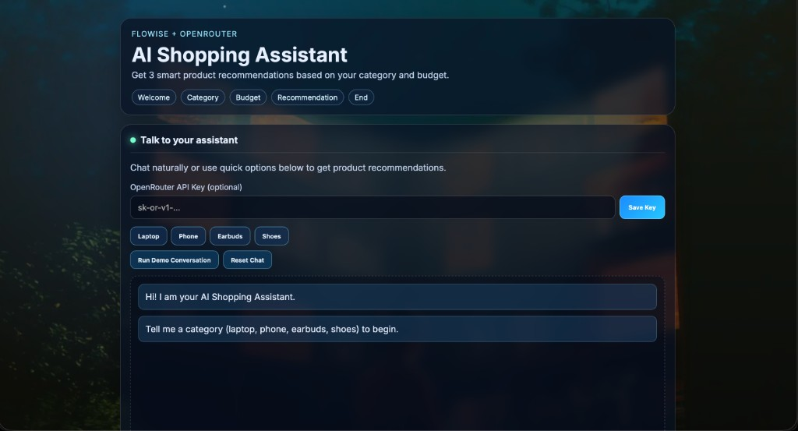

# AI Shopping Assistant

A responsive, modern shopping recommendation assistant built with a conversational UX.  
Users provide a product category and budget, and the assistant returns the top 3 product recommendations with clear reasoning.

## Features

- Interactive multi-step assistant flow: `Welcome -> Category -> Budget -> Recommendation -> End`
- Quick category actions for faster input (`Laptop`, `Phone`, `Earbuds`, `Shoes`)
- One-click demo mode for testing without any API key
- Local recommendation engine (works out of the box)
- Optional OpenRouter enhancement for AI-polished responses
- Clean glassmorphism UI with background hero art

## Tech Stack

- HTML5
- CSS3
- Vanilla JavaScript
- Optional: OpenRouter Chat Completions API

## Project Structure

```text
.
├── index.html
├── styles.css
├── app.js
└── assets
    ├── hero.png
    └── screenshots
        └── ui-home.png
```

## Getting Started

### 1) Clone repository

```bash
git clone https://github.com/jdhruv555/ai_shopping_assistant.git
cd ai_shopping_assistant
```

### 2) Run locally

Open `index.html` directly, or use a static server:

```bash
python3 -m http.server 8080
```

Then visit: `http://localhost:8080`

## How to Use

1. Open the chat interface.
2. Enter a category (or click a quick category button).
3. Enter your budget in INR.
4. Get top 3 recommendations instantly.
5. Use **Run Demo Conversation** to test everything without external setup.

## Optional OpenRouter Setup

To enable AI-enhanced recommendation wording:

1. Enter your OpenRouter API key in the **OpenRouter API Key (optional)** field.
2. Click **Save Key**.
3. Ask for recommendations as usual.

If no API key is provided, the app continues using the built-in recommendation logic.

## Screenshots

### Main UI



## Deployment

You can deploy this project as a static site on Vercel:

```bash
npm i -g vercel
vercel
```

## Author

Made by **Dhruv Jha**
